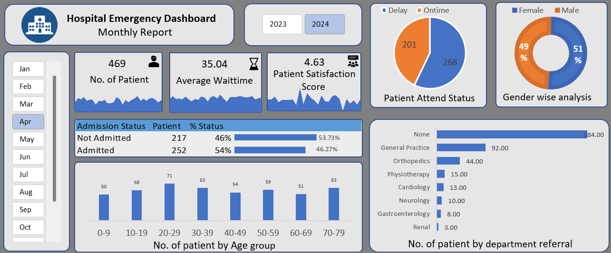

# 🏥 Hospital Emergency Dashboard

An interactive Hospital Emergency Dashboard created using **Microsoft Excel**.

## 📊 Features
- Total number of patients
- Average waiting time
- Patient satisfaction score
- Admission status analysis
- Gender-wise analysis
- Age group analysis
- Department referral analysis
- Interactive Year and Month slicers

## 🛠️ Tools Used
- Microsoft Excel
- Pivot Tables
- Pivot Charts
- Slicers

## 📷 Dashboard Preview

## 👨‍💻 Author
**Alok Yadav**
